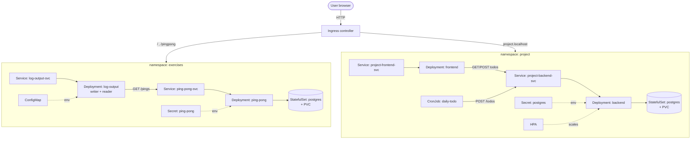

# System architecture (exercise 3.11)

High-level diagram of the cloud-native system across the two namespaces.

> Replace this with an exported PNG if the course requires an image file; the
> Mermaid block above renders directly on GitHub.
